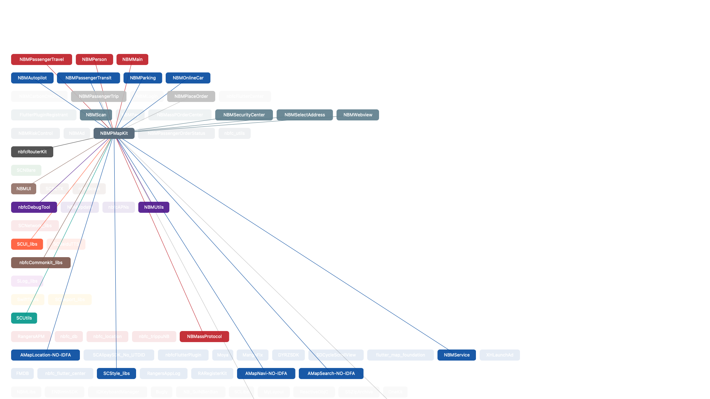

# Podfile.lock
解析 Podfile.lock 文件模块的依赖关系，并展示依赖图。上下层依赖关系

[app下载：PodfileLock.app](source/PodfileLock.app.zip)

或者下载源码运行

使用方式：运行软件选择一个Podfile.lock文件

根据需要此处生存的信息保持至 md 格式文件，使用Typora 等支持Markdown语法的app打开，

可以查看详细依赖信息和依赖图：

